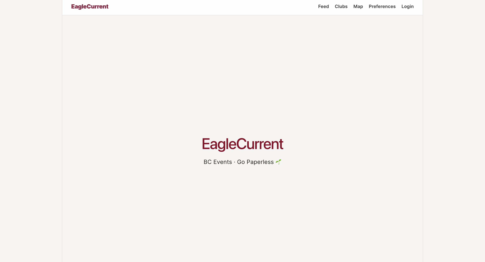
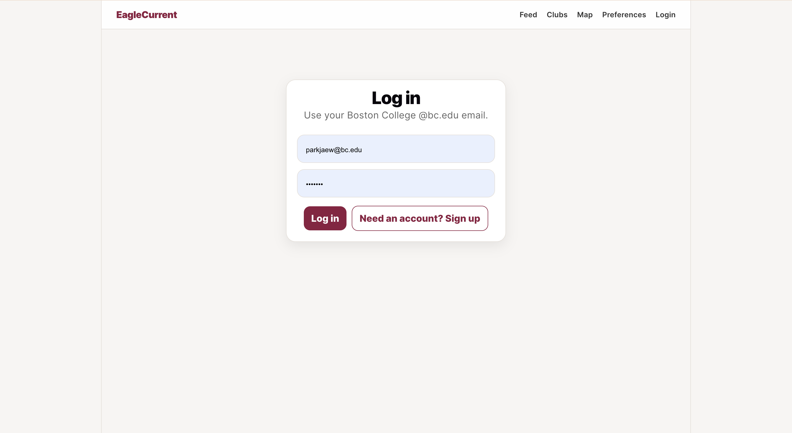
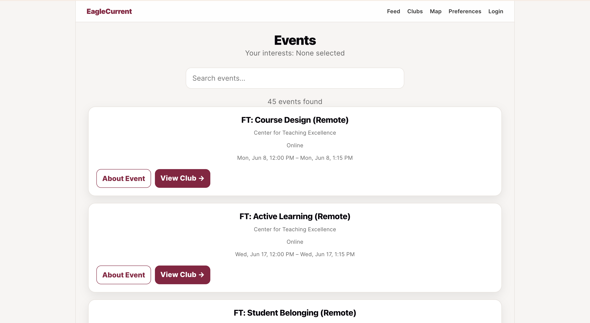
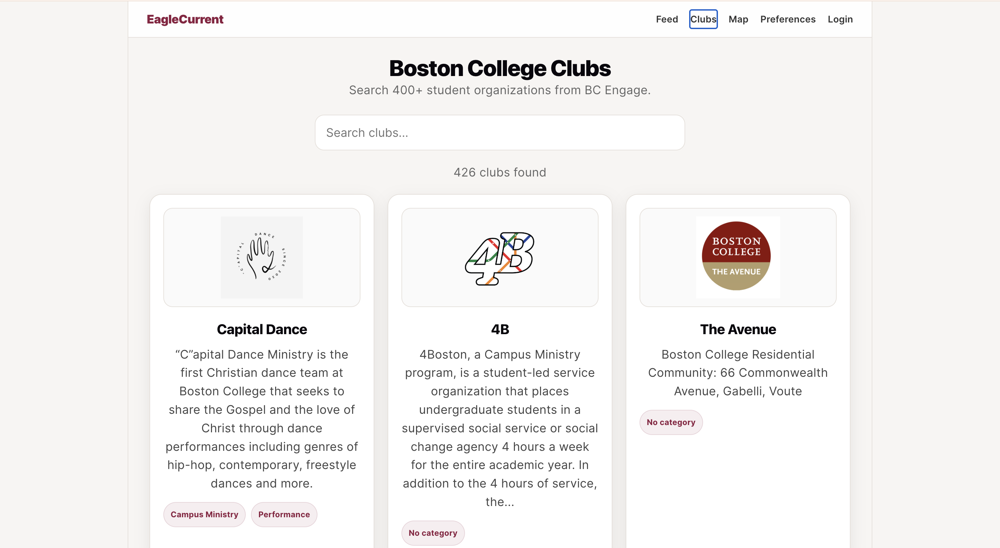
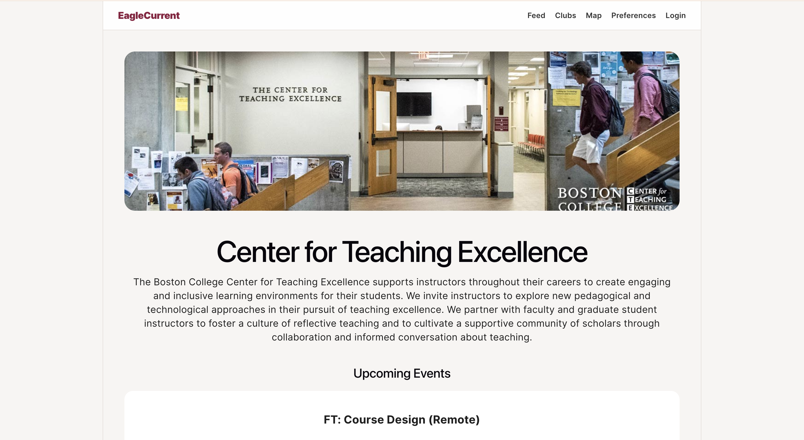

# EagleCurrent 🦅🌱

**EagleCurrent** is a full-stack campus event discovery platform for Boston College students and student organizations.

It helps students discover relevant campus events, explore clubs, view events on a live campus map, and receive event recommendations based on their interests.

<p align="center">
  
</p>

---

## Demo & Pitch

- **Product Demo:** [Watch on YouTube](https://youtu.be/_QaKr-vNcW4)
- **Pitch Video:** [Watch on YouTube](https://youtu.be/RbiD2m4d_ZY?si=3i2MNsWoF6FmsCEq&t=1)
- **Pitch Deck:** [View on Canva](https://canva.link/jgisq0fxpbbgm2e)

---

## Features

- **BC Email Authentication**  
  Users can sign up and log in with a Boston College `@bc.edu` email.

- **Interest-Based Onboarding**  
  Students select interests such as leadership, music, business, computer science, and more.

- **Personalized Event Feed**  
  Events are ranked using student interests and club categories.

- **Live Event Data Sync**  
  Events are pulled from Boston College’s Campus Labs / Engage platform and stored in Supabase.

- **Club Directory**  
  Students can browse and search 400+ Boston College student organizations.

- **Club Detail Pages**  
  Each club page shows its description, categories, and related events.

- **Interactive Campus Map**  
  Events with mapped locations appear as pins on a live campus map.

- **Expandable Event Details**  
  Students can quickly scan events and expand details only when needed.

---

## Screenshots

### Login

<p align="center">
  
</p>

### Event Feed

<p align="center">
  
</p>

### Expanded Event Details

<p align="center">
  
</p>

### Club Discovery

<p align="center">
  
</p>

### Club Detail Page

<p align="center">
  
</p>

---

## Why I Built This

Boston College has hundreds of student organizations and campus events, but event discovery is fragmented across posters, emails, club pages, and different platforms.

Students often miss events they would have attended, while clubs rely heavily on physical promotion.

**EagleCurrent** is designed as a digital-first event discovery system that makes campus events easier to find while supporting a more paperless promotion model.

---

## Tech Stack

| Area | Tools |
|---|---|
| Frontend | React, TypeScript, Vite |
| Backend / Database | Supabase, PostgreSQL |
| Authentication | Supabase Auth |
| Data Sync | TypeScript scripts |
| Map | React Leaflet, Leaflet |
| Data Source | Boston College Campus Labs / Engage APIs |

---

## Architecture

```txt
Boston College Campus Labs / Engage APIs
        ↓
syncCampusEvents.ts / syncCampusClubs.ts
        ↓
Supabase PostgreSQL
        ↓
React + TypeScript Frontend
        ↓
Auth / Onboarding / Feed / Clubs / Map
```

---

## Data Pipeline

EagleCurrent uses custom sync scripts to pull real Boston College club and event data into Supabase.

Sync clubs:

```bash
npm run sync-clubs
```

Sync events:

```bash
npm run sync-events
```

Run the app locally:

```bash
npm run dev
```

---

## Core Pages

| Route | Description |
|---|---|
| `/` | Splash screen |
| `/auth` | Login / sign up |
| `/welcome` | Role selection |
| `/onboarding` | Interest selection |
| `/feed` | Personalized event feed |
| `/clubs` | Searchable club directory |
| `/clubs/:orgId` | Club detail page |
| `/map` | Live campus event map |

---

## Local Setup

Clone the repository:

```bash
git clone https://github.com/jaewonparkk/eaglecurrent-platform.git
cd eaglecurrent-platform
```

Install dependencies:

```bash
npm install
```

Create a `.env` file:

```env
VITE_SUPABASE_URL=your_supabase_project_url
VITE_SUPABASE_ANON_KEY=your_supabase_anon_key
```

Start the app:

```bash
npm run dev
```

---

## Current Status

EagleCurrent currently supports:

- Supabase authentication
- `@bc.edu` email validation
- Interest onboarding
- Event feed
- Event search
- Expandable event details
- Interest-based event ranking
- Club directory
- Club detail pages
- Interactive map
- Campus Labs club sync
- Campus Labs event sync

---

## Next Steps

- Improve recommendation logic
- Add saved events
- Add RSVP flow
- Build club / OSI dashboard
- Add poster reduction impact analytics
- Deploy production version on Vercel
- Add stronger backend validation for `@bc.edu` users

---

## Author

Built by **Jaewon Park**  
Boston College · Computer Science & Mathematics